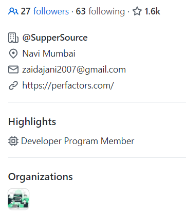

# SupperSource badge

Do you want to join <b>SupperSource</b> and get its badge? 

## Getting the badge

#### The badge is just a badge, but if you are not active, you will be removed.

1. Fork This repository on github.
2. Add your name to the names.txt file.
3. Commit your changes and make a pull request.

Your request will be merged within the next few days.

## To enable the badge.

0. Click the link in the email you'll receive from GitHub asking you if you'd like to join the organization
1. Go to the [supperSource organization](https://github.com/supperSource)
2. Click "People"
3. Search for your name in the list
4. Click the "Private" lock next to your name
5. Select "Public" from the dropdown

Thats it! You're now a member of the organization.

---

After enabling the badge, if you happen to not be active, you will be removed from the organization.

Active includes creation of a new or a forked repo every month and atleast 10 contributions a month.

### Thanks for joining!
